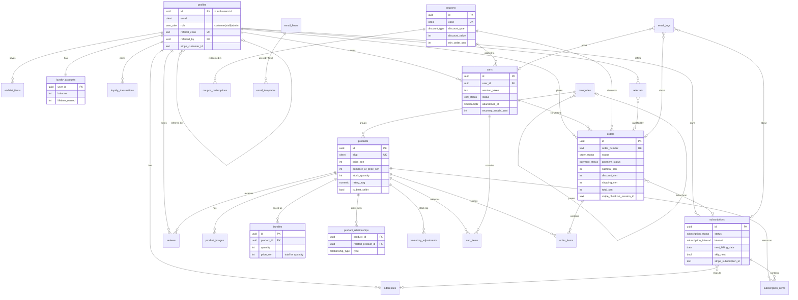

# Vitalis — Entity Relationship Diagram

Generated from the migrations in `supabase/migrations/`. Monetary columns are
integers in **sen** (RM 1 = 100 sen). Render this on GitHub or any Mermaid
viewer.

## Table groups

| Domain | Tables |
|---|---|
| **Identity** | `profiles`, `addresses` |
| **Catalog** | `categories`, `products`, `product_images`, `bundles`, `product_relationships`, `inventory_adjustments` |
| **Social proof** | `reviews`, `wishlist_items`, `newsletter_subscribers` |
| **Cart & Orders** | `carts`, `cart_items`, `orders`, `order_items` |
| **Subscriptions** | `subscriptions`, `subscription_items` |
| **Loyalty & Referrals** | `loyalty_accounts`, `loyalty_transactions`, `referrals` |
| **Promotions** | `coupons`, `coupon_redemptions` |
| **Marketing** | `email_templates`, `email_flows`, `email_logs`, `settings` |

## Key design decisions

- **Money as integer sen** everywhere — no floats, matching Stripe's amount model.
- **RLS default-deny.** Every table has explicit policies (`0009_rls.sql`).
  Order creation and webhooks run via the service-role key, which bypasses RLS.
- **Snapshots over joins for history.** `order_items` copies product name/SKU/price
  and orders copy address JSON, so historical orders are immutable.
- **Denormalized aggregates** (`products.rating_avg/_count`, `loyalty_accounts.balance`)
  are maintained by triggers for fast reads.
- **Coupon enumeration prevented** — `coupons` is staff-only; customers validate
  codes through the `validate_coupon()` SECURITY DEFINER RPC.
